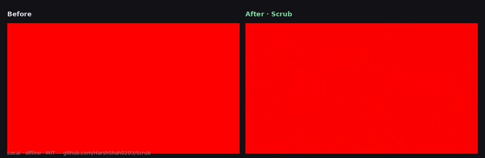

# Scrub

[](https://github.com/HarshShah0203/Scrub/actions/workflows/ci.yml)
[](LICENSE)
[](https://www.python.org/)
[](#quick-start)
[](https://github.com/HarshShah0203/Scrub/stargazers)
[](https://github.com/HarshShah0203/Scrub/network/members)

Local, **offline** hygiene for **media and documents you own**: EXIF / C2PA / Content Credentials, hidden Unicode in text, plus research-style tools for studying invisible watermark robustness (including SynthID-class mid-band carriers discussed in public literature). Nothing leaves your machine.

Most “AI mark” tools stop at clipboard Unicode or a PDF tag. Scrub covers **that plus pixels, video, and audio**.

| Layer | What it actually does | Honest limit |
|---|---|---|
| **Text** | Strip zero-width / bidi / Unicode tag chars and space homoglyphs | Does **not** paraphrase away statistical token-sampling marks |
| **Documents** | Core/app props, HTML generator meta, SVG `<metadata>`, PDF Info/XMP (pypdf or exiftool) | Compressed C2PA in PDF is best-effort |
| **Images** | EXIF/IPTC/XMP + best-effort C2PA/JUMBF; optional spectral/spatial disruption; corner-badge inpaint | No detector guarantee |
| **Video / audio** | Drop container tags; optional spectral pass on short video; codec/resample chain | Clips >90s skip the spectral pass |

> Use only on files you have rights to modify. See [NOTICE.md](NOTICE.md). Transforms are **best-effort**. Product names below are shorthand for publicly discussed signal families.

<p align="center">
  
</p>

## Quick start

```bash
git clone https://github.com/HarshShah0203/Scrub.git
cd Scrub
python3.12 -m venv .venv
.venv/bin/pip install -r requirements.txt

# Inspect (JSON) then write a cleaned *copy*
.venv/bin/python cli.py inspect notes.md
.venv/bin/python cli.py clean notes.md -o ~/Desktop/Scrub
.venv/bin/python cli.py clean photo.jpg -o ~/Desktop/Scrub
.venv/bin/python cli.py clean photo.jpg -o ~/Desktop/Scrub --metadata-only

.venv/bin/python tk_app.py          # native UI
.venv/bin/python app.py             # browser UI → http://127.0.0.1:7860
```

macOS extras: `brew install ffmpeg python@3.12 python-tk@3.12`  
Linux extras: `sudo apt install ffmpeg python3-venv python3-tk`  
Optional Mac app: `.venv/bin/python scripts/build_app.py --install` → Spotlight **Scrub**.

Optional PDF helpers: `pip install pypdf` (already in `requirements.txt`) and/or `exiftool`.

## Agent skill (Cursor / Claude Code)

This is the same distribution path people already use for local file hygiene in coding agents:

```bash
# Cursor
mkdir -p ~/.cursor/skills
ln -sfn "$(pwd)/skills/scrub" ~/.cursor/skills/scrub

# Claude Code
mkdir -p ~/.claude/skills
ln -sfn "$(pwd)/skills/scrub" ~/.claude/skills/scrub
```

Then ask the agent to inspect or scrub a file you own. The skill runs `python cli.py` locally and forbids “undetectable / guaranteed bypass” language.

## Programmatic API

```python
from watermark_remover import clean_file

out_path, detail = clean_file(
    input_path="/path/to/image.jpg",
    output_dir="/path/to/out",
    strength="medium",
    use_spectral=True,
    remove_visible=True,
    write_audit=True,
)
```

Documents and text go through the same `clean_file` / `cli.py clean` entry point.

## Using the app

1. Add images / video / audio / documents you are allowed to modify (batch OK; HEIC/AVIF supported)
2. Pick an output folder
3. Choose **Metadata + signal disruption** or **Metadata only** (documents always get metadata + Unicode hygiene)
4. Defaults favor spectral disruption on media, badge inpaint, and an audit JSON
5. Optional: diffusion regeneration if you install `torch` + `diffusers`
6. Start — originals stay put; outputs use a `_clean` suffix

## Signal families (public discussion)

| Family | Typical transforms here |
|---|---|
| Hidden Unicode / bidi / tag chars | Deterministic delete / space fold |
| Mid-band pixel carriers (e.g. SynthID-class) | FFT dampening, noise, mild JPEG |
| Frequency / latent-style marks | Resize cycle, crop/pad, FFT |
| Small corner UI badges | Detect + soft inpaint |
| Audio spectral masks | Resample, filters, codec swap |
| Short video | Per-frame spectral pass (≤90s) + ffmpeg re-encode |

## Limitations

- No cryptographic guarantee; detectors are probabilistic and change over time
- No proprietary codebook or vendor API is used here
- Pixel-identical reconstruction is not a goal
- Statistical text watermarks need a *rewrite*, which this repo does not ship as a silent “remove mark” button
- Video spectral pass skips clips longer than 90s (ffmpeg chain still runs)
- Only process files you own or have explicit rights to modify

## Layout

| File | Role |
|---|---|
| `cli.py` | Unified inspect / clean |
| `text_hygiene.py` | Hidden Unicode (stdlib) |
| `document_strip.py` | PDF / DOCX / ODT / HTML / SVG / Markdown |
| `watermark_remover.py` | Image / video / audio pipelines |
| `spectral_attack.py` | Adaptive FFT carrier disruption |
| `visible_mark.py` | Corner-badge inpaint heuristic |
| `c2pa_strip.py` | Best-effort C2PA / JUMBF scrub |
| `audit_report.py` | Before/after JSON |
| `tk_app.py` / `app.py` | Native + Gradio UIs |
| `skills/scrub/` | Agent skill |
| `NOTICE.md` | Scope and trademarks |

## Research lineage

1. Hu et al. (2024), *Stable Signature is Unstable* — [arXiv:2405.07145](https://arxiv.org/abs/2405.07145)
2. Broader regeneration / signal-processing watermark-robustness literature
3. Community analyses of mid-band carriers (e.g. [Synthid-Bypass](https://github.com/00quebec/Synthid-Bypass))
4. [DeepMind SynthID](https://deepmind.google/models/synthid/) docs (reference only; no affiliation)

## Contributing

PRs welcome — detectors, longer-video performance, Windows packaging, tests. See [CONTRIBUTING.md](CONTRIBUTING.md).

If Scrub is useful, a **star** or **fork** helps others find a local offline option.

## License

MIT — see [LICENSE](LICENSE). Also read [NOTICE.md](NOTICE.md).
